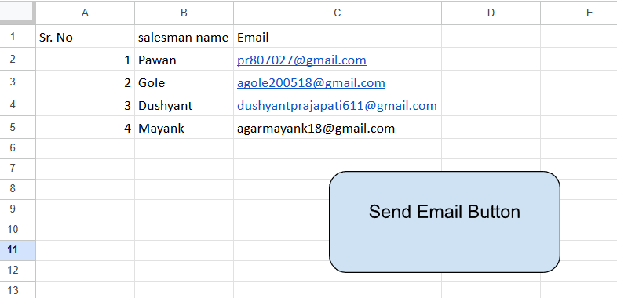

# Google Sheets Sales Report Automation 📊

This project uses **Google Apps Script** to automatically generate **sales reports for each salesman** from Google Sheets and send them as **PDF via email**.

## 🚀 Features

* Automatically filters sales data for each salesman
* Generates individual **PDF sales reports**
* Sends reports directly to the **salesman's email**
* Fully automated using **Google Apps Script**
* Works directly with **Google Sheets data**


## 📸 Screenshots

### 📊 Google Sheet1


---

### 📊 Google Sheet2


---

### 💻 Apps Script Code


---

### 📧 Email Output


## 📂 Project Structure

```
sales-report-automation
│
├── Code.gs        # Main Google Apps Script file
└── README.md      # Project documentation
```

## 🧾 Google Sheets Structure

### Sheet1 (Salesman List)

| Sr No | Salesman Name | Email |
| ----- | ------------- | ----- |

### Sheet2 (Sales Data)

| Order_Date | Sale Date | Region | State | City | Product | Quantity | Status | Salesman | AGE | Price per Unit | Sales Amount | Day | Month Name |

The script filters data based on the **Salesman column**.

## ⚙️ How It Works

1. The script reads salesman names and emails from **Sheet1**.
2. It scans **Sheet2** and filters sales records for each salesman.
3. A temporary spreadsheet is created containing the filtered data.
4. The spreadsheet is converted into a **PDF report**.
5. The report is automatically sent to the **salesman's email**.

## ▶️ How to Use

1. Open your **Google Sheet**
2. Go to **Extensions → Apps Script**
3. Paste the script inside `Code.gs`
4. Save and run the function:

```
sendSalesReports()
```

5. Allow permissions when prompted.

## 📧 Output

Each salesman receives an email containing:

* Their **filtered sales data**
* A **PDF sales report attachment**

## 🛠 Technologies Used

* Google Apps Script
* Google Sheets
* Google Drive API
* Gmail (MailApp)

## 📌 Author
Pawan Rathore

🔗 Connect With Me LinkedIn:https://www.linkedin.com/in/pawan-rathore18/

**Pawan**

---

⭐ If you find this project useful, consider giving it a star on GitHub!
